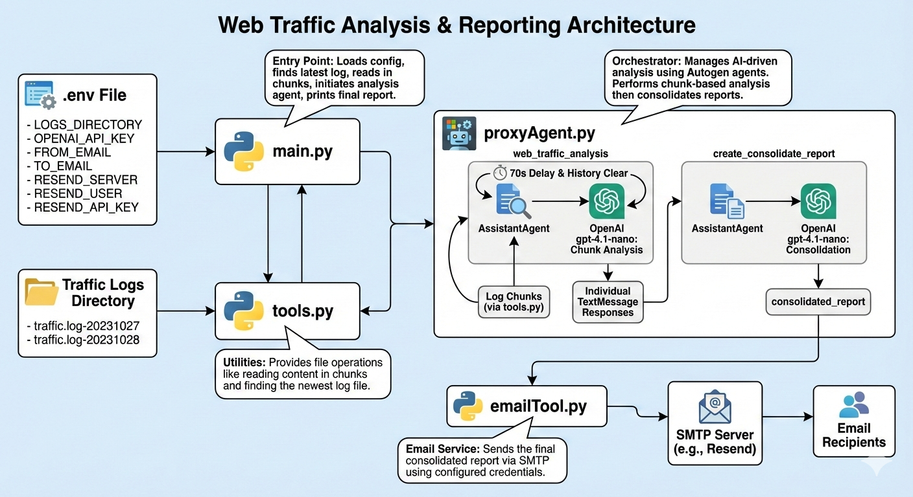

# Web Traffic Analysis with AI Proxy Agent

<a name="readme-top"></a>

## About

This project utilizes an AI proxy agent built with `autogen_agentchat` to analyze web traffic logs. It processes large log files in chunks, generates individual reports for each chunk, and then consolidates these into a single comprehensive markdown report. The consolidated report focuses on core user browsing behavior, ignoring background requests like images, JavaScript, and tracking. Finally, it sends the consolidated report via email.

## Architecture

The project consists of three main Python modules:

1.  **`main.py`**:
    *   Entry point of the application.
    *   Loads environment variables from a `.env` file (e.g., `LOGS_DIRECTORY`, `OPENAI_API_KEY`, `FROM_EMAIL`, `TO_EMAIL`, `RESEND_SERVER`, `RESEND_USER`, `RESEND_API_KEY`).
    *   Uses `tools.py` to find the latest traffic log file.
    *   Reads the traffic log file in chunks using `tools.py`.
    *   Calls `proxyAgent.py` to perform the analysis and consolidation.
    *   Prints the final consolidated report.

2.  **`tools.py`**:
    *   Provides utility functions for file operations.
    *   `read_file_content(file_name)`: Reads a given file and returns its content as an array of strings, each up to 30,000 characters long.
    *   `get_latest_traffic_log_file(directory)`: Scans a specified directory for files matching the `traffic.log-YYYYMMDD` pattern and returns the path to the newest log file.

3.  **`proxyAgent.py`**:
    *   Orchestrates the AI-driven traffic analysis and report consolidation.
    *   Initializes an `OpenAIChatCompletionClient` with the specified model (`gpt-4.1-nano`).
    *   `web_traffic_analysis(model_client, traffic_log_file_content)`:
        *   Takes the chunks of the traffic log file.
        *   For each chunk, it creates a `TextMessage` and sends it to an `AssistantAgent` (configured with a system prompt for web traffic analysis).
        *   It waits for 70 seconds between sending each chunk to manage API rate limits.
        *   It clears the agent's history after each chunk to prevent context window overflow (meaning each chunk is analyzed independently).
        *   Returns a list of individual `TextMessage` responses.
    *   `create_consolidate_report(model_client, all_agent_responses)`:
        *   Takes all the individual `TextMessage` responses from `web_traffic_analysis`.
        *   Constructs a consolidation prompt and creates `TextMessage` objects for each individual report.
        *   Uses another `AssistantAgent` (configured with a system prompt for report consolidation) to merge these reports into a single `consolidated_report`.
        *   Calls `send_email` from `emailTool.py` to send the final report.
        *   Returns the `consolidated_report`.
    *   `run_proxy_agent(traffic_log_file_content)`:
        *   The main function in this module, it sets up the `model_client` and calls `web_traffic_analysis` and `create_consolidate_report` in sequence.
        *   Returns the final `consolidated_report`.

4.  **`emailTool.py`**:
    *   Provides the `send_email(subject, report)` function to send an email using `smtplib` and configured environment variables (e.g., `RESEND_SERVER`, `RESEND_USER`, `RESEND_API_KEY`, `FROM_EMAIL`, `TO_EMAIL`).

## Architecture



## Installation

This project requires **Python 3.12 or later**.

1.  **Clone the repository:**
    ```bash
    git clone https://github.com/your-repo/web-proxy.git
    cd web-proxy
    ```

2.  **Install `uv` (if you don't have it):**
    `uv` is a fast Python package installer and resolver.
    ```bash
    pip install uv
    ```

3.  **Create a virtual environment and install dependencies:**
    ```bash
    uv venv
    source .venv/bin/activate  # On Windows, use `.venv\Scripts\activate`
    uv pip install -e .
    ```

## Quick Start

1.  **Create a `.env` file:**
    In the root directory of the project (same level as `pyproject.toml`), create a file named `.env` and populate it with your environment variables:

    ```
    LOGS_DIRECTORY=/path/to/your/traffic/logs
    OPENAI_API_KEY="sk-your-openai-api-key"
    FROM_EMAIL="your-sender-email@example.com"
    TO_EMAIL="your-recipient-email@example.com"
    RESEND_SERVER="smtp.resend.com" # Or your SMTP server
    RESEND_USER="resend" # Or your SMTP username
    RESEND_API_KEY="re_your_resend_api_key" # Or your SMTP password
    ```
    *   Replace `/path/to/your/traffic/logs` with the actual path where your `traffic.log-YYYYMMDD` files are located.
    *   Replace `"sk-your-openai-api-key"` with your actual OpenAI API key.
    *   Replace email and Resend details with your actual credentials.

2.  **Run the application:**
    Ensure your virtual environment is activated (`source .venv/bin/activate`).
    ```bash
    python src/main.py
    ```
    The script will find the latest traffic log, process its content, generate a consolidated report, and attempt to email it. The consolidated report will also be printed to the console.

